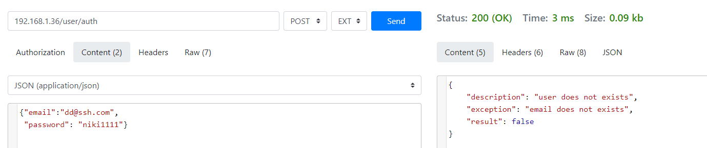
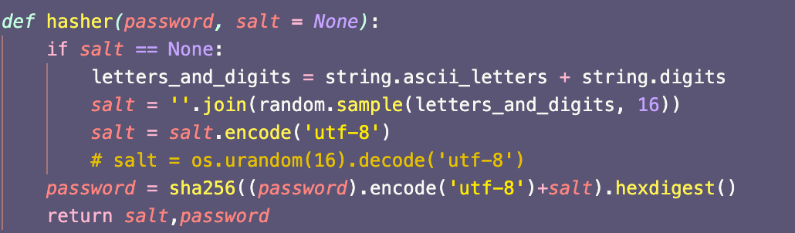
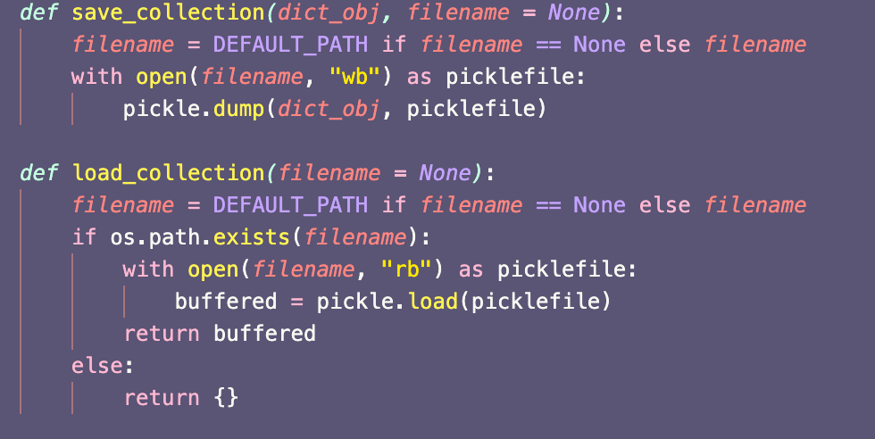
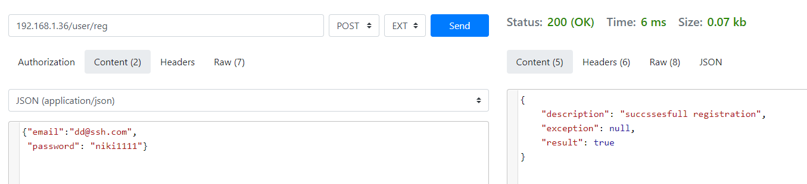
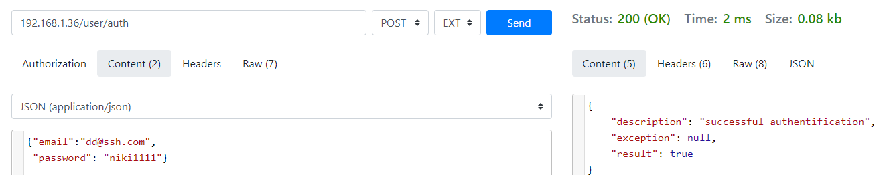
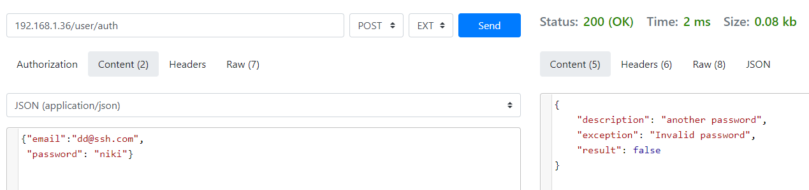
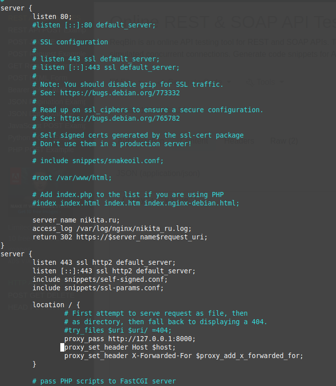

# Создание микросервиса
# Цель работы
Познакомиться с механизмом работы современных веб-приложений и микросервисной архитектуры в процессе выполнения творческого задания.
# Задания для выполнения
На основе предложенного шаблона реализуйте сервис, реализующий регистрацию пользователей. Сервис должен поддерживать REST API и коллекцию /user/, хранящую данные о логинах и паролях пользователей, зарегистрированных в системе. Сервис должен принимать и отдавать информацию в формате JSON. Сервис должен хранить следующую информацию про каждого пользователя: логин, хеш пароля (лучше с солью), дату регистрации.
Пытаемся залогиниться под несуществующим пользователем

Пароль хранится в хешированном виде

Информация по пользователям хранится в виде коллекций с помощью модуля pickle

Все данные принимаются и отдаются в формате .JSON

Например зарегистрировали и попробуем залогиниться

Попробуем залогиниться с невалидным паролем

Настройте веб-сервер по Вашему выбору (Apache2 или nginx) таким образом, чтобы он поддерживал соединение по протоколу HTTPS. Для этого сгенирируйте самоподписанный сертификат SSL. Был сгенерирован самоподписанный ssl

